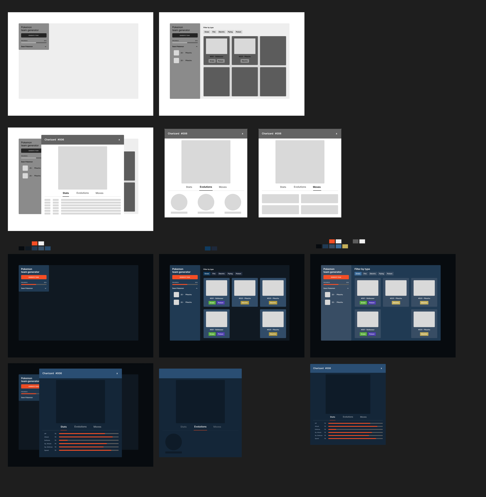
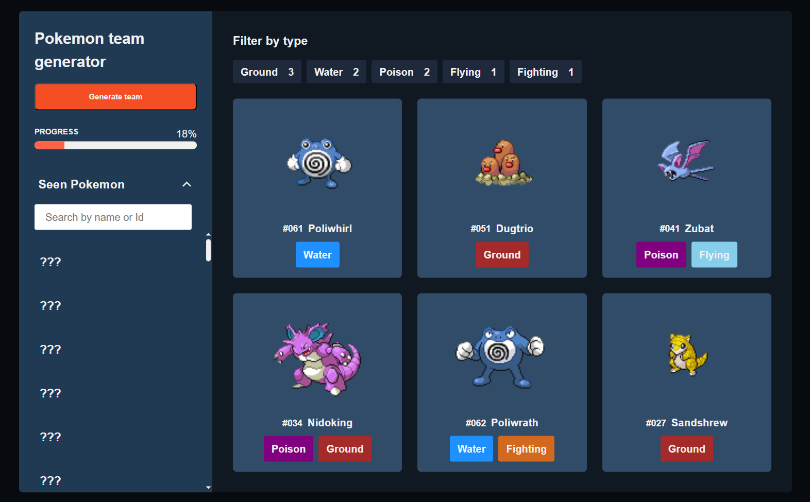
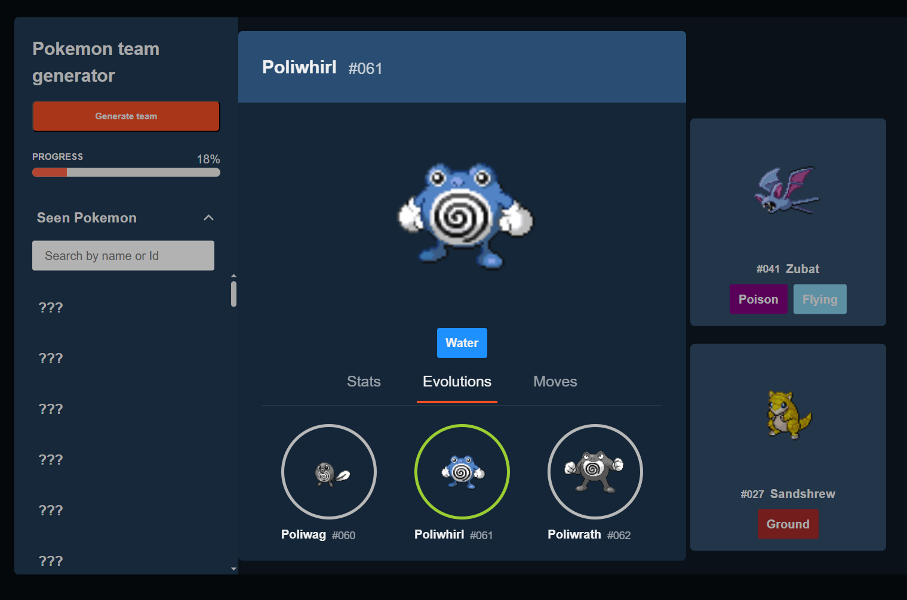

# Pokémon Functional JS App

A **vanilla JavaScript Pokémon app** built with a **functional programming (FP) approach**, inspired by ReactJS architecture.  
The goal of this project was to **practice advanced JavaScript concepts**, including async/await, recursion, promises, and error handling, while exploring FP in a real-world context.

> **Note:** The UI design was created in Figma and then translated to code. UI refinement was intentionally limited to focus mainly on JavaScript practice and learning.

---

## **Features**

### Random Team Generator
- Generates a random team of Pokémon.
- Stores API data in `localStorage` to reduce repeated calls.  
  > *Four years ago, I tried using this API by generating random numbers and fetching each Pokémon individually. This time, I implemented a caching mechanism using localStorage to minimize network calls and improve performance.*

### Pokémon Detail View
- Modular card component.
- Click a card to open a modal displaying:
  - Stats
  - Type
  - Skills
  - Sprite
- Evolution chain solved recursively.  
  > *This part was particularly exciting and challenging—it helped me deeply understand how recursion can be used to traverse and render evolution chains dynamically.*

### Pokedex Panel
- Search input with debounce to prevent excessive filtering.
- Dynamically populates when generating a team.
- Handles “No results match” gracefully.
- Displays a progress bar filled base on the number of discovered Pokémon.
- Efficiently updates shared observables and tracks discovered Pokémon using Sets/Maps.

### Dynamic Toggle Buttons
- Filters Pokémon based on team types.
- Displays the number of Pokémon per type and orders toggles accordingly.
- Generates toggle buttons dynamically using a frequency map.  
  > *Learning about frequency maps was a game-changer! I used them to dynamically generate toggle filters that show each Pokémon type and the count of Pokémon in the team.*
- Smooth CSS transitions for visual feedback.

---

## **Highlights & Learnings**
> These were the most exciting and insightful parts of the journey. The “cherry on top” of my learning experience.

1. **Recursive Evolution Chain** – Building a recursive solution to display Pokémon evolutions was both challenging and rewarding. It gave me a practical understanding of how recursion can simplify complex hierarchical data structures.
2. **Dynamic Frequency-based Toggles** – Translating data frequency maps into a dynamic UI helped me bridge functional data transformations with UI state updates.
3. **API Caching with localStorage** – Implementing caching logic taught me how to optimize API usage efficiently while improving load performance.
4. **Custom Observable System** - Designing my own observer pattern allowed components to reactively share state, similar to how frameworks like React handle it. I t deepend my understanding of state management, reactivity, and decoupled data flow in functional programming

---

## **Tech Highlights**
- Vanilla JavaScript using functional programming concepts.
- Modular, reusable components inspired by ReactJS patterns.
- Async/await, promises, recursion, and error handling in real-world use.
- Efficient data handling with Sets, Maps, and observables.
- Debounced search and dynamic filtering.
- CSS transitions for smooth UI updates.
- Created a lightweight **observable-based state system**, similar to a state machine, to share reactive data across components without prop drilling.

---

## **Development Timeline**
- **19-Sep-25:** Planned FP project; brainstormed async, recursion, promises, error handling.
- **21-Sep-25:** Created moodboards, user flows, and design concepts.
- **22-Sep-25:** Started FP app; fetched Pokémon data with async/await.
- **23–24 Sep:** Added clickable Pokémon cards with modal (initial styles pending).
- **25–29 Sep:** Progressed with Pokémon API integration.
- **6-Oct-25:** Solved Pokémon Evolution Chain recursively.
- **10-Oct-25:** Finished search panel; designed UI in Figma.
- **16-Oct-25:** Completed app with random team generator, dynamic toggles, and full Pokédex panel.

---

## **Visuals**

### From Figma to Code
*(Designed in Figma and translated to vanillaJS)

### Live Demo
*(Main app interaction and state changes in action)

### App Look
*(Closer look at key UI sections)

---
## Credits 
Data provided by [PokeAPI](https://pokeapi.co/) - used for educational and portfolio purposes

